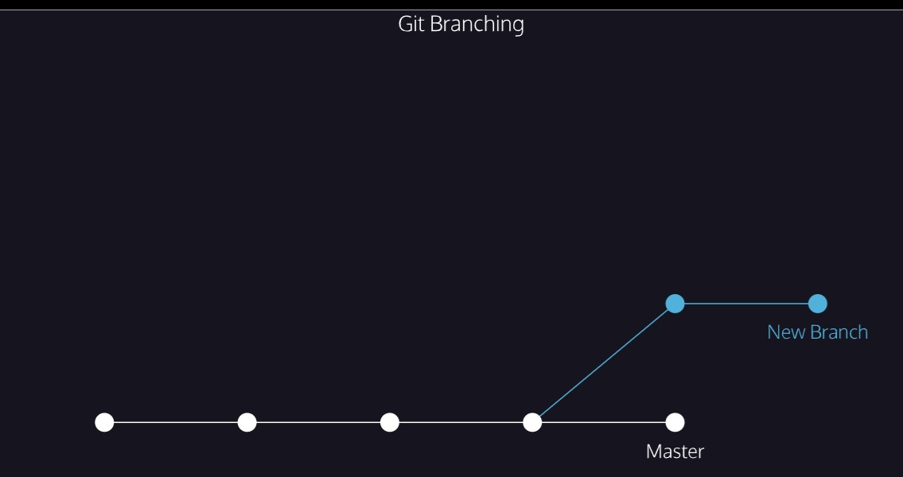

Git allows us to create branches to experiment with versions of a project. Imagine you want to create a version of a story with a happy ending. You can create a new branch and make the happy ending changes to that branch only

The diagram below illustrates branching.

- The circles are commits, and together form the Git project’s 
Preview: Docs Loading link description
commit
 history.

- New Branch is a different version of the Git project. It contains commits from the main 
Preview: Docs Loading link description
branch
 but also has commits that it does not have.

